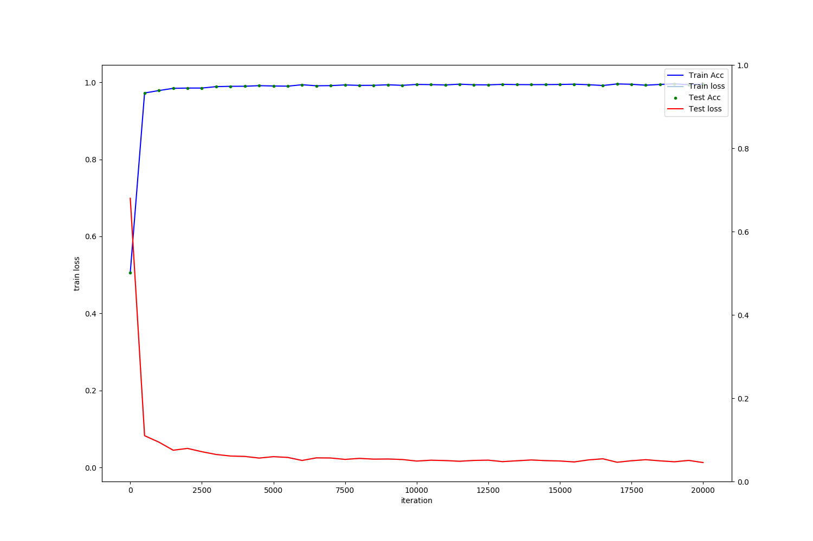
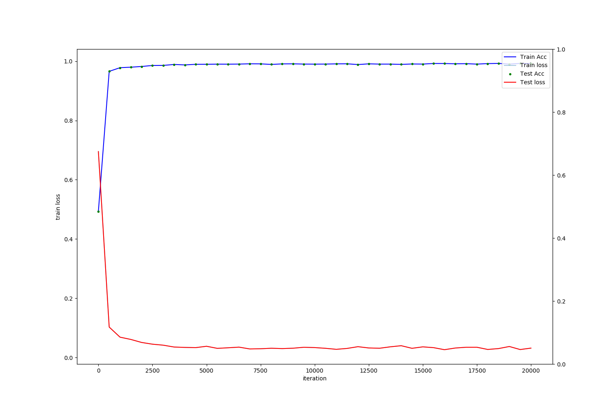
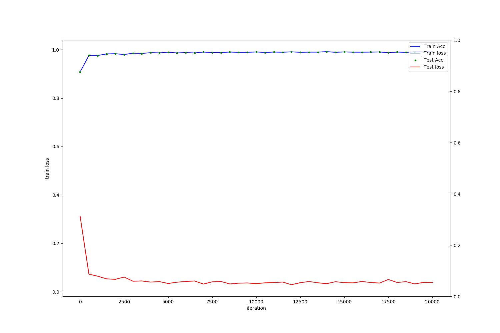
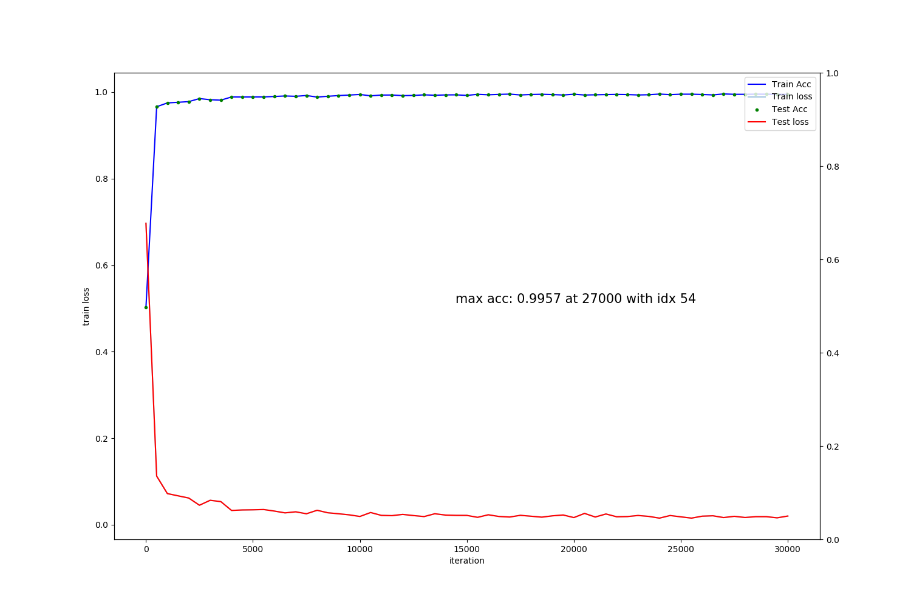
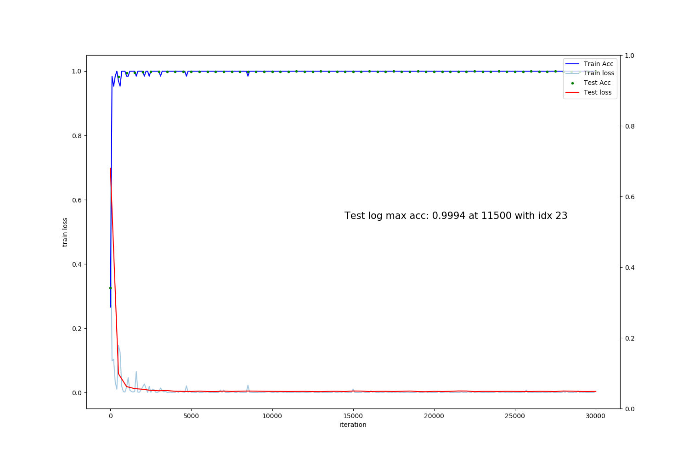
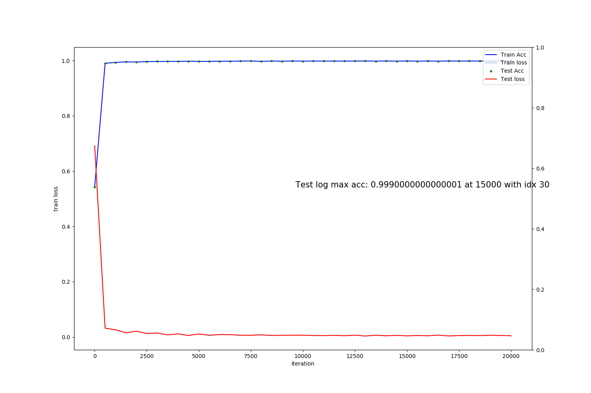

[SMARTVISION GLOBAL](https://svisionglobal.com)

# parkingclassifier-caffe
Produced files (components) from caffe-related training data
and it can be used inside the Caffe

# Data Preparation
0. Use `parking_aug_after_split.py` in parkingClassify repo. to augment the data with proper changes.
    > input_source : path\to\6phase_dataset ouput_images: ./augimg, then we need to combine original images and its augmented images (6phase_aug) for next step.
1. Use `data_split.py` in parkingClassify repo. to split the given data into train and test sets with the predefined ratio.
    > from 6phase_augimg which has been combined with the above procedure.
2. Follow the Procedure step. 

#### Update 
- **20200218-20200219 experiments have similar results but best so far**
- 20191221: train with lenet32x40_3 for 20191221_data which has been augmented with options of contrast, sat, hue, and rnd vertical flip only in training phase.
- 20191228: train with lenet32x40_3 for 20191228_data changing brightness 0.2 to 0.4 of 20191221 data  **TEST WITH THIS OPTIONS**
- 20200202: train with lenet32x40_3 for 20200202_data changing br, cont, sat to 0.4 of 20191221 data
- 20200204: svg_object_detect.py for detecting the objects using the given models, solve with pythorch
- 20200217: train with lenet32x40_3 for 20200217_data changing br, cont, sat to 0.4 with augmenation only without original data mixing 
- 20200218: fine tuning with lenet32x40_3 for 20200217_data from 2500.caffemodel after changing br, cont, sat to **0.8**, hue to 0.5 with augmenation only without original data mixing
  - this exp follows the fine tuning method 2!! 
  - this experiment includes realdata from minicars
  - it starts from 90.78 accuracy using 20200217 2500 iteration data.
  - it will have same procedures with 20200217
- 20200218-1: more iterations util 30000 with 20200218 data and settings, result in 99.2
- 20200218-2: until 60000, result in 99.2 **not changes much** 
- 20200219: same procedure with 20200218 but with 0.6 for br, ctr, sat (same with 20200217 settings except 0.4 to 0.6 ), result in 99.2 **no changes**
- 20200219-1: 2020217 pretrained + 20200219 combination  (base_lr: 0.01->0.001 with 20200219_iter_17000), result in (99.3 at 1000 iter)
- 20200219-2: 2020217 pretrained + 20200219 combination  (base_lr: 0.01->0.001 with 20200219_iter_17000 + resume from 10000 to 30000),
- 20200220: 2020217 pretrained + reweights method 3 (base_lr: 0.01->0.001 with 20200217_iter_18500 + resuming from 18500 to 30000),
- 20200220-1: 20200217 pretrained + reweights method 1+2 (base_lr: 0.01->0.001 from 0 iteration) **best**
- 20200221: 2020217 with o.6 br only in normal processing (base_lr: 0.01) (max acc: 0.9957 at 27000 with idx 54) **best**

[x] From here, the test will be for 4 phase case
- 20200223: changes settings for 4 phase parking with previous parking(haar trained except "vehicles") data sets (max acc: 0.9994 at 13500 with idx 27)
- 20200223-1: both test and train graph (tests with real 4phase data resulted in 34% accuracy)
- 20200224: combined with 1500 4phase data with 2020223 dataset
- 20200228: haar (0/1 adjustment, 0.2 only) dataset + **6900 4phase dataset (0.2, 0.4, 0.6 br only)** (99.9 % at 15000 : delievery to VPD_Models_4Phase) 

# Procedure 
0. develop a pytorch model and convert the model into caffe's files using pytorch2caffe project for easy architecture development
1. I assume that caffe-related files including .prototxt(s) (_solver.prototxt} and _model.prototxt) and resides in the source root (ex. /workspace/)
2. edit xxx.prototxt for a target database and xxx_solver.prototxt for the xxx.prototxt location 
3. first edit and run list_files.sh in the source directory (ex. /workspace/parkingclassifier-caffe/20190812_data/)
4. edit create_pk_class.sh and run it to generate database files in the caffe 
5. train the data after editting a solver file.

# Model files and their descriptions
- lenet32x40_1 : 20190820 12phase lenet32x40_1
- lenet32x40_2 : 20191125 6 phase 10000 samples training 14->28: acc: 99.5
- lenet32x40_3 : 20191126 6 phase 10000 samples training 50->28: acc: 99.7
- lenet32x40_3_1:LeNet32x40_2 Test under lenet32x40_3 
- lenet32x40_3 : 20191221 6 phase all data(46000 each class) including augmented data (contrast: 0.2, sat: 0.2, hue: 0.2 with data_split): acc: 99.5
- lenet32x40_3 : 20191228 6 phase all data(46000 each class) including augmented data (brightness: 0.4, sat: 0.2, hue: 0.2 with data_split): acc: 99.75
- lenet32x40_3 : 20200202 6 phase all data(46000 each class) including augmented data (brightness: 0.4, cont: 0.4 sat: 0.4, hue: 0.2 with data_split): acc: 99.61  at 19000 iters )

- lenet32x40_3 : 20200217 6 phase aug data(23000 each class) including augmented data (brightness: 0.4, cont: 0.4 sat: 0.4, hue: 0.2 with data_split): acc: 99.26  at 18500 iters )  

- lenet32x40_3 : 20200218 6 phase aug data(23000 each class) including augmented data (brightness: 0.8, cont: 0.8 sat: 0.8, hue: 0.5 with data_split): (acc 99.2 at 14000 iters about 4 hours (13991 secs)) **_not much difference_**
- lenet32x40_3 : 20200218-1 -> until 30000, results in 99.2 at 29500 **_no effective_**
- lenet32x40_3 : 20200218-2 -> until 60000, results in 99.2 at 32000 **_no effective_**

- lenet32x40_3 : 20200219 6 phase aug data(23000 each class) including augmented data (brightness: 0.6, cont: 0.6 sat: 0.6, hue: 0.5 with data_split): (acc 99.2 at 17000 iters about 4 hours (13991 secs)) **_not much difference_**
- lenet32x40_3 : 20200219-1 -> 20200217 pretrained + 0.6 version  (base_lr : 0.01 -> 0.001) : 99.3 at 10000 **not improved much** _however, it works well at dark time_
- lenet32x40_3 : 20200219-2 -> 20200217 -> 20200219 -> 30000 iters (pretrained + 0.6 version)  (base_lr : 0.01 -> 0.001) : 99.33 at 19500 **almost same as previous settings**
- lenet32x40_3 : 20200220, 20200217 best pretrained + 0.6 version resumption approach from 20200217 18500 **no difference**
- lenet32x40_3 : 20200220-1, 20200217 best pretrained + 0.6 version reweights approach from 0 iteration (base_lr:0.01->0.001) 
  - 20200218 results were worse than before, 20200219/20 produced similar results. 20200220-1 gives **still best** (lenet32x40_3_ive_20200220_resume_iter_30000.caffemodel) [o]
- lenet32x40_3 : 20200221, 20200217 data with 0.6 br changes only (normal approach with 46000 samples : max acc: 0.9957 at 27000 with idx 54) 
  - 밝기만 0.6으로 변동시킨 후 모든셋팅을 0.2로 놓았던 셋팅과 합한 데이터셋에 대한 결과가 제일 좋아 보였으나, 하지만 바닥에 장애인, 여성전용, VIP 등과 같은 지시문이 있는 경우에 잘 안됨.
  - 결과적으로 pretrained 를 하고 specific 하게 finetuning 하는 것이 가장 좋음 (20200220 30000 best so far).  

[x] From here, the test will be for 4 phase case
- lenet32x40_3 : 20200223, new for 4 phase parking status (99.94% at 13500 iteration) -> test with real 4phase data, its result was only 34% accuracy

- lenet32x40_3 : 20200224, put 1500 data into 2020023 dataset and test until 20000 iteration
- lenet32x40_3 : 20200228, put 6900 data into 2020023 dataset and test until 20000 iteration (haar set: select same #s for 0, and 4phase set:6900 data augmented to 0.2, 0.4, 0.6bry only settings -> 99.9% at 15000)
 - 이경우 특이한 케이스는 일단 빼고 훈련을 시켰음. 
 - /1/ 99.9%, /0/ 99%로 /0/의 경우 실제 데이터가 더 필요한 상황임.
   
- lenet32x40_3 : same as 20200228, this time tried to solve early saturation with learning rate adjustment with 0.005 from 0.01

# Model file confirmation for the given system
1. ./build/tools/ive_tool_caffe 0 h w ch /workspace/parkingclassifier-caffe/lenet32x40_2.prototxt 
# Solver
_xxx_solver.prototxt

# Training with log 
0. in the caffe root
1. ./build/tools/caffe train -solver /workspace/parkingclassifier-caffe/xxx_solover.prototxt 2>&1 | tee your_name.log

* 1-1. Saving the information to display the curve after training as follows:
	GLOG_logtostderr=1 ./build/examples/train_net.bin solver.prototxt 2> caffe.log 
* 1-2. This command does not display the process status during training, instead it saves the log information into the given log file (caffe.log)
* 1-3. To plot the log, use parse_log.py and plot the graph with plot_caffe.py I made.

# Converting to binary for the company
1. ./build/tools/ive_tool_caffe 1 h w ch (channel: 3 for color) /workspace/parkingclassifier-caffe/lenet32x40_2.prototxt \
	/workspace/parkingclassifier-caffe/lenet32x40_2.caffemodel /workspace/parkingclassifier-caffe/lenet32x40_2.bin
2. ** important ** To convert ive-caffe in a success into a bin file, the prototxt 	should include TEST only in accuracy layer at the last part. 
- 2.1 However, to make log and draw the accuracy graphs for TRAIN/TEST phases, the last accuracy layer should include both.

# Note:
Using docker 
	1. in windows, Lower/Capital character file name is not effective
	2. in ubuntu, it is sensitive
	3. sudo docker run -it --ipc=host -p 9428:22 -p 9488:8888 -p 9482:6006 -v ~/workspace:/workspace sangkny/caffe:caffe-ive-bin /bin/bash
	4. under the docker, cd /opt/source/caffe (here is caffe root)
	
# Draw the Accuracy/Loss Graph
0. We assumed that we got log file during the Train phase as the above <traing with log>
1. In caffe, ./tools/extra/parse_log.py /path/from/logfile/xxx.log /path/to/output => makes xx.train and xx.test  
2. use plot-caffe.py I made 
3. Please include Train/Test phases in the Accuracy Layer. IVE does not allow the train phase included in accurracy Layer in the prototxt file. 
- 3.1 However, for the purpose of drawing the Accuracy/Loss graph, it does not matter.

# Fine-Tuning
##### Method 1
    https://hamait.tistory.com/520 
    https://medium.com/@alexrachnog/using-caffe-with-your-own-dataset-b0ade5d71233
0. solver : base_lr to be smaller
1. prototxt: insert parameter with lr_mult with higher score after rename the name of proper Layer (lr_mult = 0 in other layers no to be updated)
2. then the Layer will be trained quckly while previous trained model changes gradually according to base_lr
3. stepsize in solver will be reduced to small
##### Method 2
0. same procedures as normal training except for using -weight options
> In caffe, ./build/tools/caffe train -solver /.../xxx_solover.prototxt -weights /.../xxx_iter_2500.caffemodel 2>&1 | tee /.../your_name.log

##### Method 3 (Resuming)
0. restart at a specific point
> In caffe, ./build/tools/caffe train -solver /.../xxx_solver.prototxt -snapshot /.../xxx_iter_xxxx.solverstate
