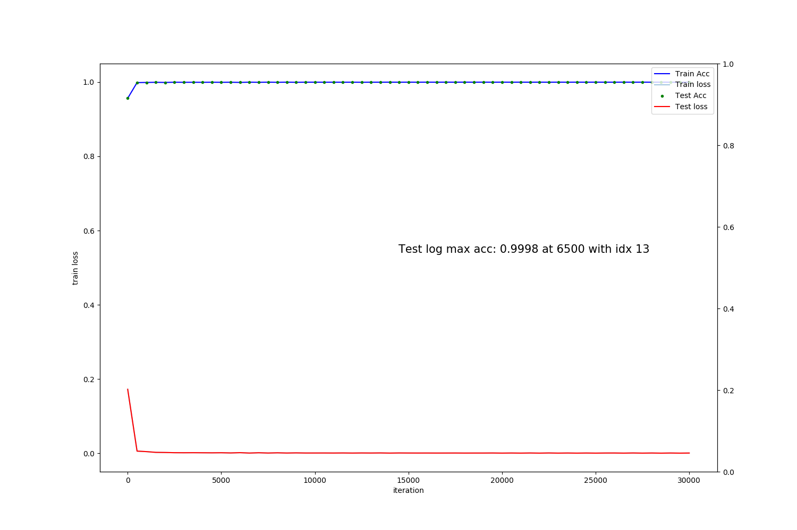
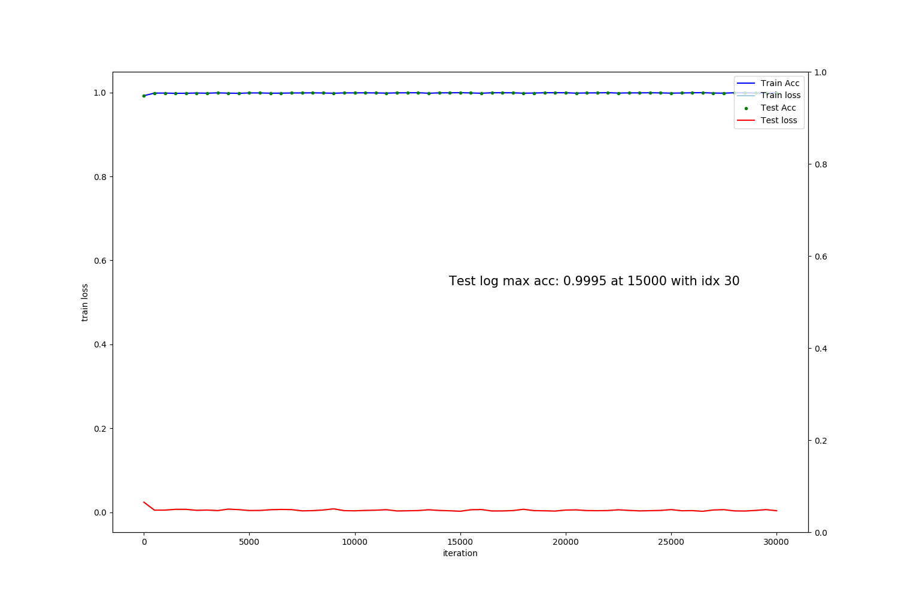
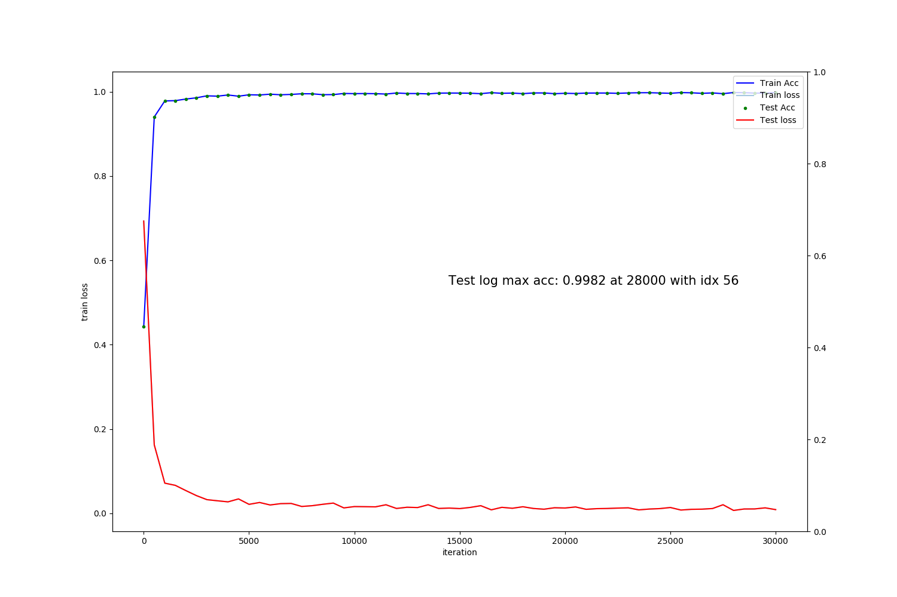
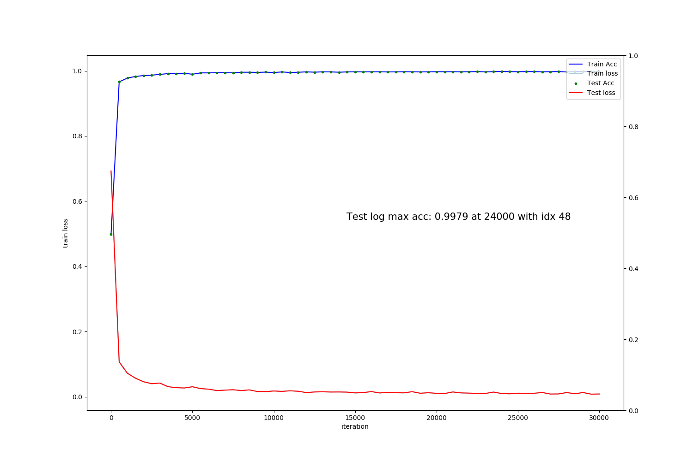

[SMARTVISION GLOBAL](https://svisionglobal.com)

# parkingclassifier-caffe
Produced files (components) from caffe-related training data
and it can be used inside the Caffe

# Data Preparation
0. Use `parking_aug_after_split.py` in parkingClassify repo. to augment the data with proper changes.
    > input_source : path\to\6phase_dataset ouput_images: ./augimg, then we need to combine original images and its augmented images (6phase_aug) for next step.
1. Use `data_split.py` in parkingClassify repo. to split the given data into train and test sets with the predefined ratio.
    > from 6phase_augimg which has been combined with the above procedure.
2. Follow the Procedure step. 
3. Inference test with infer_caffe_with_pyTorch in pyTorch-caffe folder에__

#### Update 
- **20200218-20200219 experiments have similar results but best so far**
- 20191221: train with lenet32x40_3 for 20191221_data which has been augmented with options of contrast, sat, hue, and rnd vertical flip only in training phase.
- 20191228: train with lenet32x40_3 for 20191228_data changing brightness 0.2 to 0.4 of 20191221 data  **TEST WITH THIS OPTIONS**
- 20200202: train with lenet32x40_3 for 20200202_data changing br, cont, sat to 0.4 of 20191221 data
- 20200204: svg_object_detect.py for detecting the objects using the given models, solve with pythorch
- 20200217: train with lenet32x40_3 for 20200217_data changing br, cont, sat to 0.4 with augmenation only without original data mixing 
- 20200218: fine tuning with lenet32x40_3 for 20200217_data from 2500.caffemodel after changing br, cont, sat to **0.8**, hue to 0.5 with augmenation only without original data mixing
  - this exp follows the fine tuning method 2!! 
  - this experiment includes realdata from minicars
  - it starts from 90.78 accuracy using 20200217 2500 iteration data.
  - it will have same procedures with 20200217
- 20200218-1: more iterations util 30000 with 20200218 data and settings, result in 99.2
- 20200218-2: until 60000, result in 99.2 **not changes much** 
- 20200219: same procedure with 20200218 but with 0.6 for br, ctr, sat (same with 20200217 settings except 0.4 to 0.6 ), result in 99.2 **no changes**
- 20200219-1: 2020217 pretrained + 20200219 combination  (base_lr: 0.01->0.001 with 20200219_iter_17000), result in (99.3 at 1000 iter)
- 20200219-2: 2020217 pretrained + 20200219 combination  (base_lr: 0.01->0.001 with 20200219_iter_17000 + resume from 10000 to 30000),
- 20200220: 2020217 pretrained + reweights method 3 (base_lr: 0.01->0.001 with 20200217_iter_18500 + resuming from 18500 to 30000),
- 20200220-1: 20200217 pretrained + reweights method 1+2 (base_lr: 0.01->0.001 from 0 iteration) **best**
- 20200221: 2020217 with o.6 br only in normal processing (base_lr: 0.01) (max acc: 0.9957 at 27000 with idx 54) **best**

[x] From here, the test will be for 4 phase case
- 20200223: changes settings for 4 phase parking with previous parking(haar trained except "vehicles") data sets (max acc: 0.9994 at 13500 with idx 27)
- 20200223-1: both test and train graph (tests with real 4phase data resulted in 34% accuracy)
- 20200224: combined with 1500 4phase data with 2020223 dataset (99.9% but stress test is not good compared to the below)
- 20200228: haar (0/1 adjustment, 0.2 only) dataset + **6900 4phase dataset (0.2, 0.4, 0.6 br only)** (99.9 % at 15000 : delievery to VPD_Models_4Phase) 
- 20200302: test with fine-tuning (lr=0.005) on the new data 0302.zip gives 100% /0/ 99.8% /1/.  
- 20200307: fine tuning method 1+2 (lr=0.001) from 20200302 weights, exactly same settings with 20200228 but with new data (13000 images) for 4phase, results in  99.98% at 23500.(**still best**)
- 20200318: fine tuning method 1+2 (lr=0.001), **from 20200307 at 23500 weights**, with only **incorrect_all data** after augmentation 0.1, 0.2, 0. 4, 0.6, 0.7 and horizonflip and affine (0.03). 
    - however, its effect was not good as described in the description section. Therefore, in 20200318-1, go with 20200302 settings with new dasta (upto 20200317 ): fine-tunning     
    - 20200318-v1: fine-tuning method 1+2 from weights 20200302 (testonly_iter_lr0005_15000.caffemodel) (same as 20200302 with 23000 new data, which augments 0.2, 0.4, 0.6 brightness and affine changes)
    - first try with only new data exclude haar, while 20200307 version included haar dataset
    - 20200318-v2: fine-tuning with haar+newdata augmentation, resulted in bad 0 object detection    
    - 20200318-v3: training haar+new data from a scratch. 99.82% at 28000 <<**best performance**>>
- 20200512: 
- 20200604: up to now, i was wrong for width x height assignment in CNN model on chip, so I will fix it now with 20200512 data
- 20200726: dropout try with LeNet32x40_3_ive.prototxt. However, it is not supported by HiSilicons
- 20200729: data (20200318(all)+20200729_data) version -> 1, (pretrained version with 20200318_data + 2020o729_data_only)->2
  * ver.1
    *
    
  * ver.2
    * 
    
- 20200731: data (20200318(all)+20200729_data) + noise (attention network )
    - 99.74 at 56500 (refer to fingures)
- 20200807: 20200729 data for 3channels 
  * 3채널 입력이 가능하다고 하여 create_pk_class 에서 -gray=false (color) 로 하여 변경을 했더니 컬러로 만들어줬나보네^^
  * 인위적으로 3channel로 만든것과 -gray=False 로 해서 만든것의 lmdb 사이즈 변화 거의 없고 성능도 그런 것 같음... 
  * 우선 급한대로 gray를 가지고 training 중.. => 인위적으로 3channel로 일괄 변환 후 test 하여 40000 에서 최적(아래 그래프 참조)인것 같아 delivery 함.
  * gray=> channel copy => 3 color 는 실제 데이터가 들어왔을 때 너무 에러가 많음..
- 20200812: (../NexQuadDataSets/3channels) 1(haar)+0(20200811 취득된 2000여장의 실사)  를 이용해서 (0.4 0.2 0.2 0.2), (0.2, 0.1, 0.1, 0.1) (0.6, 0.4, 0.4, 0.4) 로 augmentation 한 데이터 (D:\sangkny\pyTest\MLDL\codes\parkingClassify-master\augimg_20200812_3channels_br04) 로 training
  * Test log max acc: 0.9995 at 21000 with idx 42 
 
 
  
# Procedure 
0. develop a pytorch model and convert the model into caffe's files using pytorch2caffe project for easy architecture development
1. I assume that caffe-related files including .prototxt(s) (_solver.prototxt} and _model.prototxt) and resides in the source root (ex. /workspace/)
2. edit xxx.prototxt for a target database and xxx_solver.prototxt for the xxx.prototxt location 
3. first edit and run list_files.sh in the source directory (ex. /workspace/parkingclassifier-caffe/20190812_data/)
4. edit create_pk_class.sh and run it to generate database files in the caffe 
5. train the data after editting a solver file.

# Model files and their descriptions
- lenet32x40_1 : 20190820 12phase lenet32x40_1
- lenet32x40_2 : 20191125 6 phase 10000 samples training 14->28: acc: 99.5
- lenet32x40_3 : 20191126 6 phase 10000 samples training 50->28: acc: 99.7
- lenet32x40_3_1:LeNet32x40_2 Test under lenet32x40_3 
- lenet32x40_3 : 20191221 6 phase all data(46000 each class) including augmented data (contrast: 0.2, sat: 0.2, hue: 0.2 with data_split): acc: 99.5
- lenet32x40_3 : 20191228 6 phase all data(46000 each class) including augmented data (brightness: 0.4, sat: 0.2, hue: 0.2 with data_split): acc: 99.75
- lenet32x40_3 : 20200202 6 phase all data(46000 each class) including augmented data (brightness: 0.4, cont: 0.4 sat: 0.4, hue: 0.2 with data_split): acc: 99.61  at 19000 iters )

- lenet32x40_3 : 20200217 6 phase aug data(23000 each class) including augmented data (brightness: 0.4, cont: 0.4 sat: 0.4, hue: 0.2 with data_split): acc: 99.26  at 18500 iters )  

- lenet32x40_3 : 20200218 6 phase aug data(23000 each class) including augmented data (brightness: 0.8, cont: 0.8 sat: 0.8, hue: 0.5 with data_split): (acc 99.2 at 14000 iters about 4 hours (13991 secs)) **_not much difference_**
- lenet32x40_3 : 20200218-1 -> until 30000, results in 99.2 at 29500 **_no effective_**
- lenet32x40_3 : 20200218-2 -> until 60000, results in 99.2 at 32000 **_no effective_**

- lenet32x40_3 : 20200219 6 phase aug data(23000 each class) including augmented data (brightness: 0.6, cont: 0.6 sat: 0.6, hue: 0.5 with data_split): (acc 99.2 at 17000 iters about 4 hours (13991 secs)) **_not much difference_**
- lenet32x40_3 : 20200219-1 -> 20200217 pretrained + 0.6 version  (base_lr : 0.01 -> 0.001) : 99.3 at 10000 **not improved much** _however, it works well at dark time_
- lenet32x40_3 : 20200219-2 -> 20200217 -> 20200219 -> 30000 iters (pretrained + 0.6 version)  (base_lr : 0.01 -> 0.001) : 99.33 at 19500 **almost same as previous settings**
- lenet32x40_3 : 20200220, 20200217 best pretrained + 0.6 version resumption approach from 20200217 18500 **no difference**
- lenet32x40_3 : 20200220-1, 20200217 best pretrained + 0.6 version reweights approach from 0 iteration (base_lr:0.01->0.001) 
  - 20200218 results were worse than before, 20200219/20 produced similar results. 20200220-1 gives **still best** (lenet32x40_3_ive_20200220_resume_iter_30000.caffemodel) [o]
- lenet32x40_3 : 20200221, 20200217 data with 0.6 br changes only (normal approach with 46000 samples : max acc: 0.9957 at 27000 with idx 54) 
  - 밝기만 0.6으로 변동시킨 후 모든셋팅을 0.2로 놓았던 셋팅과 합한 데이터셋에 대한 결과가 제일 좋아 보였으나, 하지만 바닥에 장애인, 여성전용, VIP 등과 같은 지시문이 있는 경우에 잘 안됨.
  - 결과적으로 pretrained 를 하고 specific 하게 finetuning 하는 것이 가장 좋음 (20200220 30000 best so far).  


[x] From here, the test will be for 4 phase case
- lenet32x40_3 : 20200223, new for 4 phase parking status (99.94% at 13500 iteration) -> test with real 4phase data, its result was only 34% accuracy

- lenet32x40_3 : 20200224, put 1500 data into 2020023 dataset and test until 20000 iteration
- lenet32x40_3 : 20200228, put 6900 data into 2020023 dataset and test until 20000 iteration (haar set: select same #s for 0, and 4phase set:6900 data augmented to 0.2, 0.4, 0.6bry only settings -> 99.9% at 15000)
 - 이경우 특이한 케이스는 일단 빼고 훈련을 시켰음. 
 - /1/ 99.9%, /0/ 99%로 /0/의 경우 실제 데이터가 더 필요한 상황임.
   
- lenet32x40_3 : 20200302, same as 20200228, this time tried to solve early saturation with **learning rate adjustment 
with 0.005 from 0.01** (99.9 at 15000 and its result is **best** so far from stress test as of today)
- lenet32x40_3 : 20200307 version, fine-tuning method (1+2) (lr=0.001) from 20200302 (lr=0.005) with the same settings with 20200228, results in 99.98 at 23500 
- lenet32x40_3 : 20200318 version, fine-tuning method (1+2) (lr=0.001) from 20200307 (at 23500 weights) with using only incorrect data after augmenting 0.1 0.2 0.4 0.6 0.7 brightness adjustment and random horizontal flip and affine (0.03)
    
 - 위의 경우는 20200307 weight에 같은 조건으로 **incorrect** 데이터만을 다양하게 augment 시킨 후 
 fine-tuning을 한것으로 쉽게 500 iteration 후에 99.% 이상의 test acc 가 되어 overfitting 또는 전결과와 다르지 않음을 예단 하였고, 
 역시 실험을 해 보니 성능이 상대적으로  떨어짐. 그래서, 정리를 하면 incorrect data 만을 가지고 fine-tuning 하는 것은 데이터가 많지않으면 효과 별로임.
 다음과 같이 실험을 20200318을 3 version으로 정리함. **The best training result comes from training with all the data from a scratch**, which is _version 3_.     
- lenet32x40_3 : _performance_report.xlsx_ 참조 
    - 20200318-v1 version, fine-tuning method (1+2) (lr=0.001) from 20200302 (lr=0.005) that is _20200228_4phase_testonly_lr0005_ 
    일단 Haar 빼고 (20200307 version included haar data), with new data, 0: 99.9% 1: 99.4 % 0 데이터에 에러를 많이 줄임, 반면에 1 데이터는 에러가 상대적으로 큼.
    - v2 version, fine-tuning method (1+2) (lr=0.001), on haar + new data for fine-tuning **합하여 진행**, 0: 99.6 1: 99.9% 로 1에 대해 성능이 좋음.
    
    - v3 version, no fine-tuning, train from a scratch with lr=0.001, 0:99.88, 1:99.79% 로 상대적으로 0/1 모두 양호함. **BEST SO FAR**   
    
 
- lenet32x40_3 : 20200512 version dataset 중 쓰이지 않았던 3/18,19,20을 합하여 3/18 folder에 넣어서 augmentation 을 한 후 기존의 200328 데이터와 합하여 0.001로 scrath부터 training 예정
    - 200318_data 와 이름만 같을 뿐 0318_data_only 와 200318_data가 합쳐진 형태이다.  
    - batchsize (64->128)     
    - 11 hours (2020/05/12/18:21 - 2020/05/13/05:12)
    - Test log max acc: 0.9984 at 28000 with idx 56
    
- lenet32x40_3 : 20200604 가로x세로 (32x40)으로 수정하여 다시 트레이닝... 전에는 40x32 이었음. 카메라 칩속에서 세로가 긴 32x40 밖에 안됨
    - 모든 조건은 동일하며 create_pk_test file에서만 가로 세로 사이즈 수정하고, bin conversion 시에 width height channels 순으로 하면 됨    
    - Test log max acc: 0.9979 at 24000 with idx 48
       
    - 20200605 lenet40x32_3_ive_20200512_4phase_lr0001_v3_iter_24000.caffemodel -> lenet40x32_3_ive_20200604_4phase_lr0001_v3_iter_24000.bin 으로 delivery    
 - lenet32x40_3 : 20200726 dropout을 사용하여 좋은 결과를 예상했으나 IVE 가 dropout을 지원하지 않음.
    
    - 위의 결과와 거의 대동소이 함. 0.9984 at 30000 with idx 60 
    
 - lenet32x40_3 : dataset 에 backup with 20200318_data.zip. 작업은 /20200318_data 에서 함.  
    * ver.1 :  20200729_data 에 20200318_data 와 20200729_40x32_data(real data) 를 합쳐서 training
      * 결과는 나쁘지 않음. plot_caffe.py 를 적용했을 때 18500 (99.68)에서 도 좋지만 30000을 사용하니 더 좋은 결과가 얻어짐. => delivery
      
      * 60000번까지 iteration 한후 기존 데이터와 training data 에 속하지 않은 18-19-20 data에서 거의 완벽에 가까운 성능이 나옴. => delivery 
       
      * attention 기능으로 data의 상부에 노이즈를 넣어서 실험을 해 봄 (99.59) at 26500. => 사용불가..  !!!    
      * <20200731-noise> : 결과는 매우 안좋음
        * 30000 iterations
      
        * 60000 iterations (- Test log max acc: 0.9974 at 56500 with idx 53)
      
    
    * ver.2 : 20200318_data 의 최종 모델을 참조하여 transfer learning with 20200729_40x32_data
      * 예정
 - lenet32x40_3 (3channels) : 20200807 2020729_data 와 같으나 채널만 3 채널
    * 0.9971 at 23500 with idx 47    
    * Test log max acc: 0.9984 at 51500 with idx 43
    -- 이번엔 data를 직접 다 (8비트에서 24비트:3채널) 바꾼다음 앞서의 3채널과의 차이를 보기 위해 진행
    * caffe는 -gray=False option에서 이것을 다 해 주는 것으로 생각되므로 굳이 8bit - 24bit으로 바꿀 필요는 없다.
    * Test log max acc: 0.9981 at 40000 with idx 80 => 일단 이것으로 delivery 함 
      
 
 - lenet32x40_3 (3channels) : 20200812 20200729_data 에 모든 데이터 br04(augmentation)로 대체
    * Test log max acc: 0.9995 at 21000 with idx 42
    * 30000 번은 1에서는 훨씬 좋으나 0에서 많이 않좋아서 일단 21000으로 delivery
      
    
 - command
    ```angular2html
    ./build/tools/ive_tool_caffe 1 32 40 1 /workspace/parkingclassifier-caffe/LeNet32x40_3_ive.prototxt /workspace/parkingclassifier-caffe/lenet40x32_3_ive_2020512_4phase_lr0001_v3_iter_24000.caffemodel /workspace/parkingclassifier-caffe/lenet40x32_3_ive_20200606_4phase_lr0001_v3_iter_24000.bin
```
 
# Model file confirmation for the given system
1. ./build/tools/ive_tool_caffe 0 w h ch /workspace/parkingclassifier-caffe/lenet32x40_2.prototxt (was wrong with 0 h w ch)
# Solver
_xxx_solver.prototxt

# Training with log 
0. in the caffe root
1. ./build/tools/caffe train -solver /workspace/parkingclassifier-caffe/xxx_solover.prototxt 2>&1 | tee your_name.log

* 1-1. Saving the information to display the curve after training as follows:
	GLOG_logtostderr=1 ./build/examples/train_net.bin solver.prototxt 2> caffe.log 
* 1-2. This command does not display the process status during training, instead it saves the log information into the given log file (caffe.log)
* 1-3. To plot the log, use parse_log.py and plot the graph with plot_caffe.py I made.


# Converting to binary for the company
1. ./build/tools/ive_tool_caffe 1 w h ch (channel: 3 for color) /workspace/parkingclassifier-caffe/lenet32x40_2.prototxt \
	/workspace/parkingclassifier-caffe/lenet32x40_2.caffemodel /workspace/parkingclassifier-caffe/lenet32x40_2.bin
1-1. (was incorrect) ./build/tools/ive_tool_caffe 1 h w ch (channel: 3 for color) /workspace/parkingclassifier-caffe/lenet32x40_2.prototxt \
	/workspace/parkingclassifier-caffe/lenet32x40_2.caffemodel /workspace/parkingclassifier-caffe/lenet32x40_2.bin
2. ** important ** To convert ive-caffe in a success into a bin file, the prototxt 	should include TEST only in accuracy layer at the last part. 
- 2.1 However, to make log and draw the accuracy graphs for TRAIN/TEST phases, the last accuracy layer should include both.

# Note:
Using docker 
	1. in windows, Lower/Capital character file name is not effective
	2. in ubuntu, it is sensitive
	3. sudo docker run -it --ipc=host -p 9482:22 -p 9488:8888 -p 9486:6006 -v ~/workspace:/workspace sangkny/caffe:caffe-ive-bin /bin/bash
	4. under the docker, cd /opt/source/caffe (here is caffe root)
	
# Draw the Accuracy/Loss Graph
0. We assumed that we got log file during the Train phase as the above <traing with log>
1. In caffe, ./tools/extra/parse_log.py /path/from/logfile/xxx.log /path/to/output => makes xx.train and xx.test  
2. use plot-caffe.py I made 
3. Please include Train/Test phases in the Accuracy Layer. IVE does not allow the train phase included in accurracy Layer in the prototxt file. 
- 3.1 However, for the purpose of drawing the Accuracy/Loss graph, it does not matter.

# Fine-Tuning
##### Method 1
    https://hamait.tistory.com/520 
    https://medium.com/@alexrachnog/using-caffe-with-your-own-dataset-b0ade5d71233
0. solver : base_lr to be smaller
1. prototxt: insert parameter with lr_mult with higher score after rename the name of proper Layer (lr_mult = 0 in other layers no to be updated)
2. then the Layer will be trained quckly while previous trained model changes gradually according to base_lr
3. stepsize in solver will be reduced to small
##### Method 2
0. same procedures as normal training except for using -weight options
> In caffe, ./build/tools/caffe train -solver /.../xxx_solover.prototxt -weights /.../xxx_iter_2500.caffemodel 2>&1 | tee /.../your_name.log

##### Method 3 (Resuming)
0. restart at a specific point
> In caffe, ./build/tools/caffe train -solver /.../xxx_solver.prototxt -snapshot /.../xxx_iter_xxxx.solverstate
